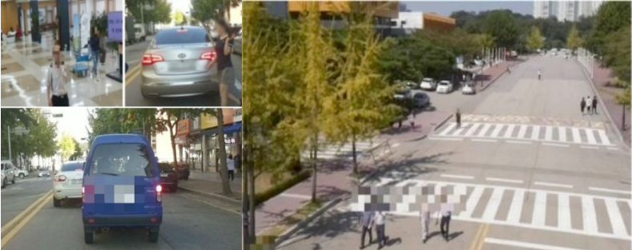
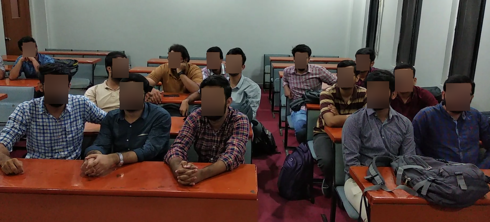
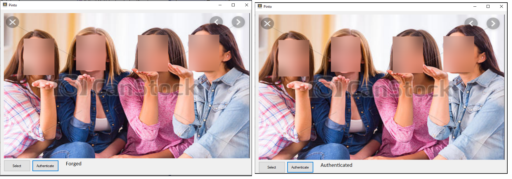

# PintoPrototype
Enabling privacy in surveillance footages

## Run
To run the script 
###### run python run.py 0 imagePath to blur the sensitive area and sign the image
###### run python run.py 1 imagePath to detect forgery in the received image

## Sample Output
#### Sample Output of Pinto

#### Sample Output of Pinto Prototype

#### Sample Output of Pinto Prototype

## Acknowledgement

Yu, H., Lim, J., Kim, K., & Lee, S. B. (2018, October). Pinto: Enabling Video Privacy for Commodity IoT
Cameras. In Proceedings of the 2018 ACM SIGSAC Conference on Computer and Communications
Security (pp. 1089-1101). ACM.  

https://medium.com/swlh/anonymize-facial-data-on-video-blur-peoples-faces-using-opencv-14ce5ed1f1aa
